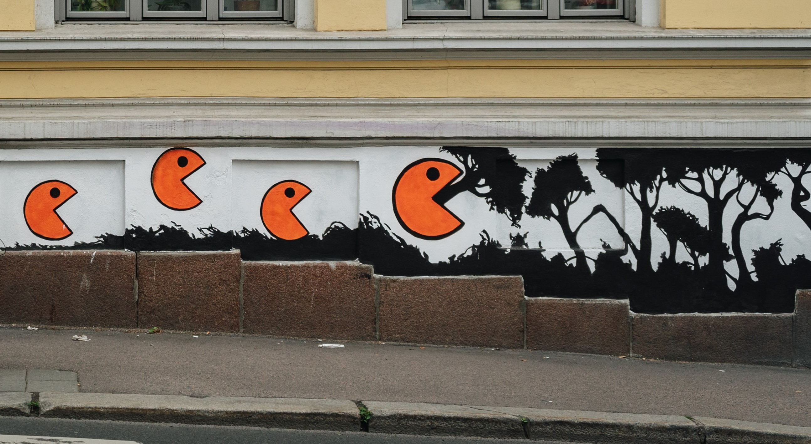
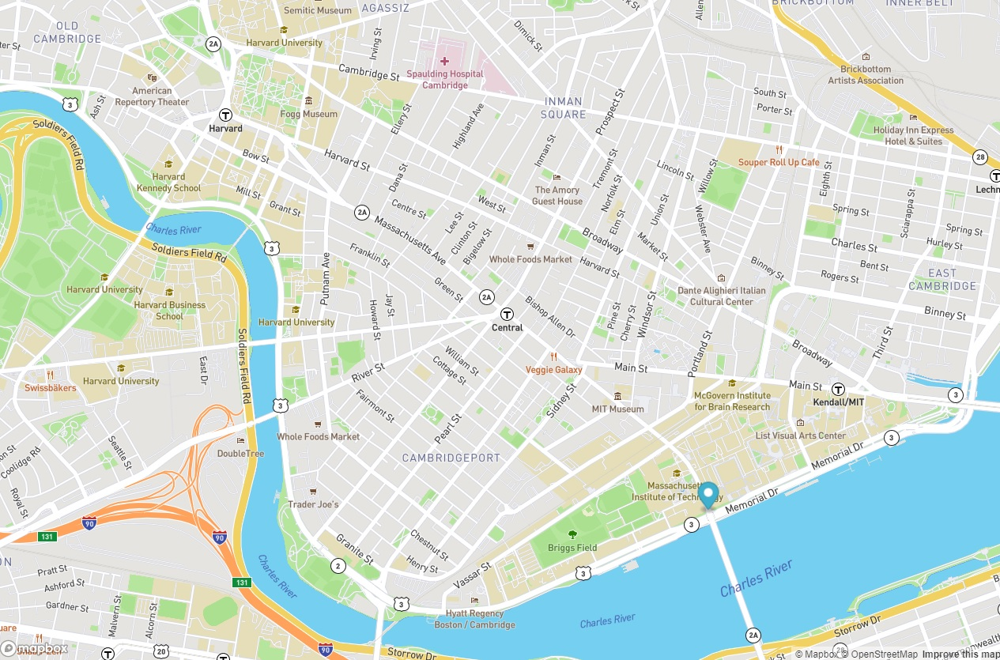

#DaNiSchaefer1721.github.io

<!DOCTYPE html>
<html lang="en">
    <head>
        <meta charset="utf-8" />
        <meta name="viewport" content="width=device-width, initial-scale=1, shrink-to-fit=no" />
        <meta name="description" content="" />
        <meta name="author" content="" />
        <h1>DaNi's Portfolio</h1>
        <link rel="icon" type="image/x-icon" href="assets/black-cat.png" />
        <!-- Font Awesome icons (free version)-->
        <!-- Google fonts-->
        <link href="https://fonts.googleapis.com/css?family=Varela+Round" rel="stylesheet" />
        <link href="https://fonts.googleapis.com/css?family=Nunito:200,200i,300,300i,400,400i,600,600i,700,700i,800,800i,900,900i" rel="stylesheet" />
        <!-- Core theme CSS (includes Bootstrap)-->
        <link href="css/styles.css" rel="stylesheet" />
    </head>
    <body id="page-top">
        <!-- Navigation-->
        <nav class="navbar navbar-expand-lg navbar-light fixed-top" id="mainNav">
            

                <a class="navbar-brand" href="#page-top">My Dazzling Digital Portfolio</a>
                <button class="navbar-toggler navbar-toggler-right" type="button" data-bs-toggle="collapse" data-bs-target="#navbarResponsive" aria-controls="navbarResponsive" aria-expanded="false" aria-label="Toggle navigation">
                <i class="fas fa-bars"></i>
                </button>
                

                    <ul class="navbar-nav ms-auto">
                        <li class="nav-item"><a class="nav-link" href="#about">About Me</a></li>
                        <li class="nav-item"><a class="nav-link" href="#projects">Projects</a></li>
                                          </ul>
                

            

        </nav>
        <!-- Masthead-->
        <header class="masthead">
            

                

                    

                        <h1 class="mx-auto my-0 text-uppercase">Hi, I'm DaNi</h1>
                                                <h2 class="text-white-50 mx-auto mt-2 mb-5"></h2>
                        <a class="btn btn-primary" href="#about">Here is My Journey</a>
                    

                

            

        </header>
        <!-- About-->
        <section class="about-section text-center" id="about">
            

                

                    

                        <h2 class="text-white mb-4">The Road So Far...</h2>
                        

                            I am currently the Director of Client Records & Compliance doing medical coding, 
                            and records for a Home Health Company here in Salt Lake City. I am also a student at MIT doing the xPro Program. I am a full time Mother of a wonderful Daughter 
                            who has BIG aspirations of working for NASA. So in trying to show my Daughter that reaching for the stars is possible, I have decided to go for my dream job of becoming a 
                            Software Engineer.
                        

                    

                

                
            

        </section>
        <!-- Projects-->
        <section class="projects-section bg-light" id="projects">
            

                <!-- Featured Project Row-->
                

                    

                    

                        

                            <h4>My Favorite Assignment Thus Far...</h4>
                            
The Eye Movement Build

                            
You can see my code on a ReadMe file on my GitHub Repo Page @ DaNiSchaefer1721.github.io

                            <li class="nav-item"><a class="nav-link" href="Assignments/Week-8---Eye-Movement/EyeMovement (2).html">Click Here If You Feel Like You Are Being Watched!!</a></li>
                        

                    

                

                <!-- Project One Row-->
                

                    

                    

                        

                            

                                
 
                                    <h4 class="text-white">PacMan</h4>
                                    
You can see my code on a ReadMe file on my GitHub Repo Page @ DaNiSchaefer1721.github.io

                                    <li class="nav-item"><a class="nav-link" href="Assignments/Week-4---PacMan/index.html">Click Here to Watch PacMan Go!!</a></li>
                                    

                                

                            

                        

                    

                

                <!-- Project Two Row-->
                

                    

                    

                        

                            

                                

                                    <h4 class="text-white">Real Time Bus Tracker</h4>
                                    
You can see my code on a ReadMe file on my GitHub Repo Page @ DaNiSchaefer1721.github.io

                                    <li class="nav-item"><a class="nav-link" href="Assignments/Real Time Bus Tracker/Real Time Bus Tracker Animation Code.html">Click Here to Track the Bus from MIT to Harvard!!</a></li>
                                    

                                

                            

                        

                    

                

            

        </section>                   
        <!-- Contact-->
        <section class="contact-section bg-black">
            

                

                    

                        

                            

                                <i class="fas fa-map-marked-alt text-primary mb-2"></i>
                                <h4 class="text-uppercase m-0">Address</h4>
                                

                                
South Jourdan, Utah

                            

                        

                    

                    

                        

                            

                                <i class="fas fa-envelope text-primary mb-2"></i>
                                <h4 class="text-uppercase m-0">Email</h4>
                                

                                
<a href="#!">Bpointshoes1721@gmail.com</a>

                            

                        

                    

                    

                        

                            

                                <i class="fas fa-mobile-alt text-primary mb-2"></i>
                                <h4 class="text-uppercase m-0">Phone</h4>
                                

                                
+1 (435) 313-1948

                            

                        

                    

                

                

                                    <a class="mx-2" href="#!"><i class="fab fa-github">DaNiSchaefer1721.github.io</i></a>
                

            

        </section>
        <!-- Footer-->
        <footer class="footer bg-black small text-center text-white-50">
Copyright &copy; DaNiSchaefer1721.github.io 2022
</footer>
        <!-- Bootstrap core JS-->
        <!-- Core theme JS-->
     </body>
</html>
